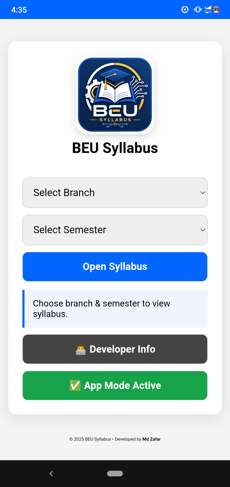
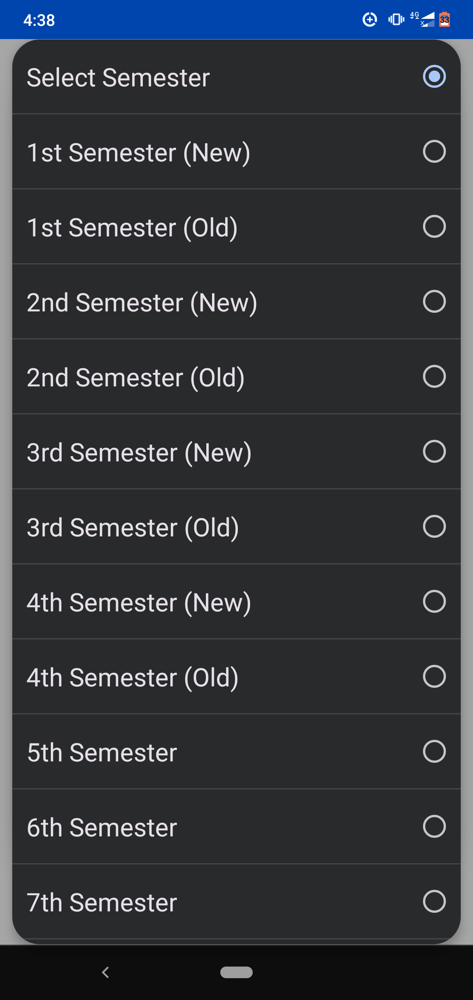
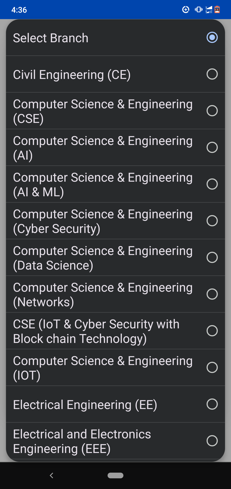
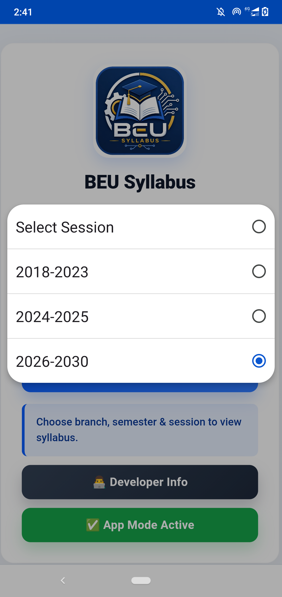
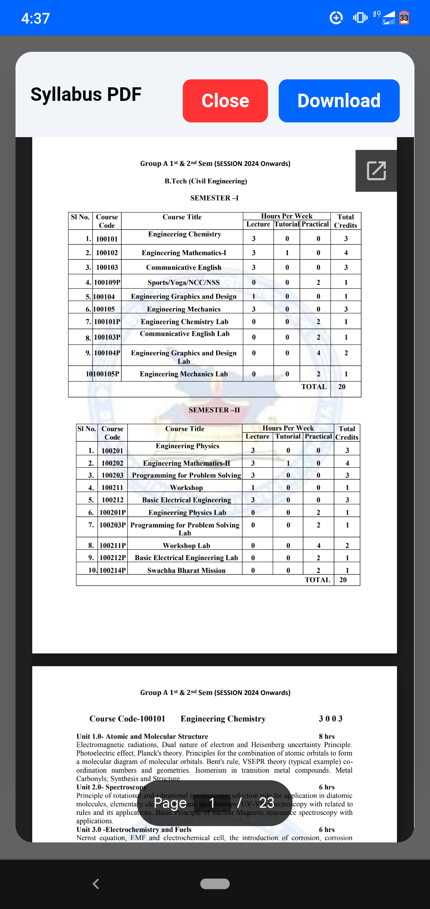
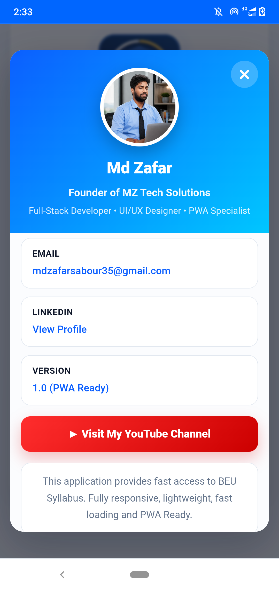

# 📚 BEU Syllabus App

<p align="center">
  
</p>

<h1 align="center">BEU Syllabus App</h1>

<p align="center">
<b>One Place for All Bihar Engineering University B.Tech Syllabus</b>
</p>

<p align="center">
<a href="https://mdzafar864.github.io/BEU-Syllabus-App/">

</a>


</p>

---

# 📖 About

**BEU Syllabus App** is a modern **Progressive Web Application (PWA)** developed for students of **Bihar Engineering University (BEU)**.

It provides **Branch-wise** and **Semester-wise** B.Tech syllabus PDFs with an easy-to-use interface. Students can instantly preview and download the latest syllabus from any device.

---

# ✨ Features

- 📚 Branch-wise Syllabus
- 🎓 Semester-wise Navigation
- 📄 PDF Preview
- 📥 One Click Download
- ⚡ Fast Loading
- 📱 Mobile Friendly
- 💻 Desktop Compatible
- 🌐 Progressive Web App (PWA)
- 🔍 Easy Navigation
- 🎨 Clean Modern UI
- 🚀 GitHub Pages Hosted
- 🔄 Regular Updates

---

# 🎓 Supported Branches

- Computer Science Engineering (CSE)
- Information Technology (IT)
- Artificial Intelligence (AI)
- Artificial Intelligence & Machine Learning (AIML)
- Artificial Intelligence & Data Science (AIDS)
- Civil Engineering (CE)
- Mechanical Engineering (ME)
- Electrical Engineering (EE)
- Electronics & Communication Engineering (ECE)
- Electrical & Electronics Engineering (EEE)
- Internet of Things (IoT)

---

# 📚 Available Semesters

- 1st Semester
- 2nd Semester
- 3rd Semester
- 4th Semester
- 5th Semester
- 6th Semester
- 7th Semester
- 8th Semester

---

# 🛠 Built With

- HTML5
- CSS3
- JavaScript
- Progressive Web App (PWA)
- GitHub Pages

---

# 📂 Project Structure

```text
BEU-Syllabus-App
│
├── index.html
├── css/
├── js/
├── assets/
├── logo.png
├── Developer.png
├── manifest.json
├── service-worker.js
└── README.md
```

---

# 🚀 Live Demo

🌐 https://mdzafar864.github.io/BEU-Syllabus-App/

---

## 📸 Screenshots

<table align="center">
  <tr>
    <td align="center">
      <b>🏠 Home</b><br><br>
      
    </td>
    <td align="center">
      <b>📂 Branch</b><br><br>
      
    </td>
  </tr>

  <tr>
    <td align="center">
      <b>🎓 Semester</b><br><br>
      
    </td>
    <td align="center">
      <b>Session</b><br><br>
      
    </td>
    <td align="center">
      <b>📄 PDF Viewer</b><br><br>
      
    </td>
  </tr>

  <tr>
    <td colspan="2" align="center">
      <b>👨‍💻 Developer Info</b><br><br>
      
    </td>
  </tr>
</table>

---

# 📦 Installation

Clone Repository

```bash
git clone https://github.com/mdzafar864/BEU-Syllabus-App.git
```

Go to Project

```bash
cd BEU-Syllabus-App
```

Open

```text
index.html
```

Or deploy using GitHub Pages.

---

# 🌟 Why Use BEU Syllabus App?

- Free to Use
- Latest BEU Syllabus
- No Login Required
- Responsive Design
- Installable as App
- Fast PDF Loading
- Clean User Interface
- Easy Navigation

---

# 🚀 Future Roadmap

- 🔍 Search Syllabus
- ❤️ Favorite Subjects
- 🌙 Dark Mode
- 📢 Notifications
- 📚 Notes Section
- 📝 Previous Year Questions
- 🤖 Telegram Bot Integration
- 📱 Android App

---

# 🤝 Contributing

Contributions are welcome!

1. Fork Repository

2. Create Branch

```bash
git checkout -b feature-name
```

3. Commit

```bash
git commit -m "Added new feature"
```

4. Push

```bash
git push origin feature-name
```

5. Open Pull Request

---

# 👨‍💻 Developer

<p align="center">

</p>

## Md Zafar

💻 Full Stack Developer

🎓 B.Tech Student

🏫 Bihar Engineering University

🌐 Portfolio

https://mdzafar864.github.io/Portfolio/

🐙 GitHub

https://github.com/mdzafar864

🌐 Website

https://mdzafar864.github.io/BEU-Syllabus-App/

---

# ⭐ Support

If this project helps you,

⭐ Star this Repository

🍴 Fork it

📢 Share it with Friends

❤️ Contribute to Improve It

---

# 📜 License

Licensed under the **MIT License**.

---

# 🙏 Acknowledgements

Special Thanks To

- Bihar Engineering University
- GitHub
- Open Source Community
- All Contributors
- Every BEU Student

---

<p align="center">
⭐ If you find this project useful, please give it a Star!
</p>

<p align="center">
<a href="https://github.com/mdzafar864/BEU-Syllabus-App">⭐ Star Repository</a> •
<a href="https://mdzafar864.github.io/BEU-Syllabus-App/">🌐 Live Demo</a> •
<a href="https://github.com/mdzafar864">🐙 GitHub</a>
</p>

---

<p align="center">
© 2026 MZ Tech Solutions. <b>All Rights Reserved.</b>
</p>
